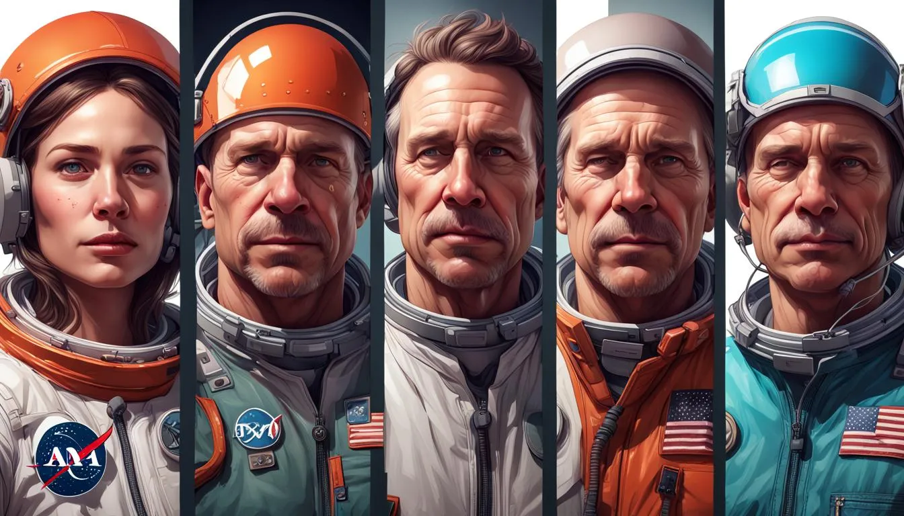

**Invent your characters** 

1. **Space Wizard (Dungeon Master):** - Starts by describing the current situation on Earth as the team prepares for the launch. They might use an AI tool to generate a specific challenge. For example, "A critical component of the spacecraft is malfunctioning due to a software bug." - Rolls 2d6 dice introduces a random element to the challenge, like determining the severity of the software bug.

2. **Graphic Designer:** - Uses an AI art generator to create an image that represents the current challenge, such as a visual of the spacecraft with an evident glitch or error message on the control panel.

3. **Medical Team Lead:** - Considers the implications of the challenge (in this case, the stress on the crew) and uses an AI tool to summarize potential psychological and physiological strategies to maintain team health under the pressure of delays and technical issues.

4. **Computer Coder:** - Takes the challenge and conceptualizes a piece of code or algorithm that could fix the software bug. They might use an AI coding assistant to draft a pseudo-code solution or outline the steps necessary to troubleshoot the problem.

5. **Librarian:** - Searches literature for any similar past incidents of spacecraft malfunctions and their resolutions or any protocols that might aid in the current situation.

6. **Military Team Lead:** - Compiles the players' information, formulates a plan to address the software bug, and prepares the team for the next steps. They might decide to allocate resources for repairs or suggest a workaround that minimizes the impact on the launch timeline.

7. **Farmer and Scientist** - Grows crops and conducts experiments. They produce food and create new inventions that can lead to discoveries. 

After each role has contributed to the turn, the team collectively decides on the best course of action to take, informed by the synthesized information. The decision is then enacted, and its consequences or results are narrated by the Space Wizard, setting up the scenario for the next turn.

