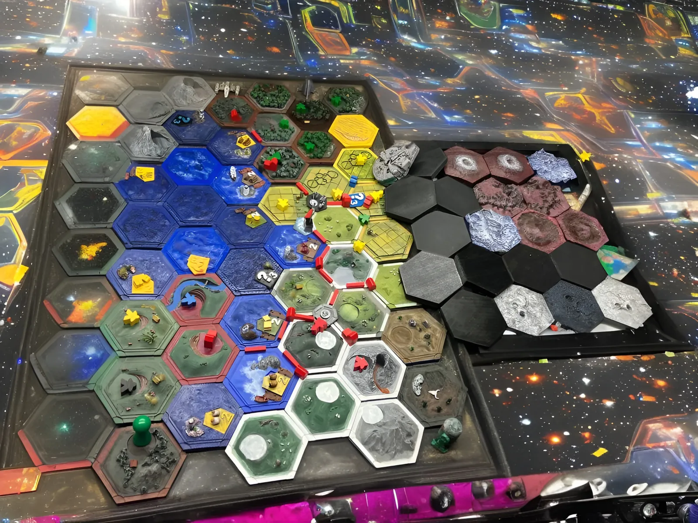
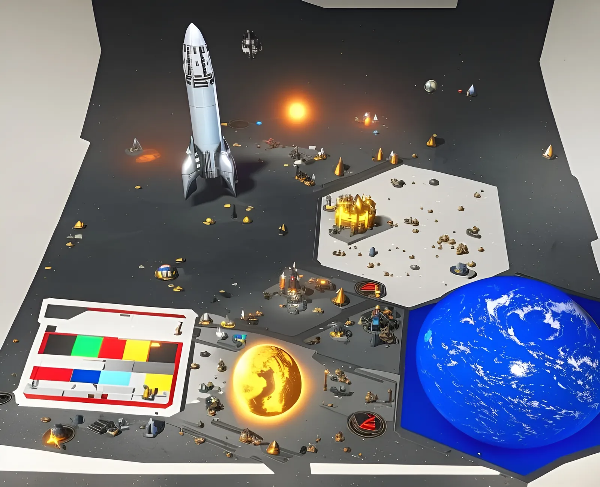

**The Evolved Board Game**
This selection of images shows potential layouts of the board game.
Each tile provides colour and shape combinations that are representative of certain types of materials and functions for the game. 
They can be evolved using promt's to create boards with different themes. 
Below are 2 evolved example boards.

