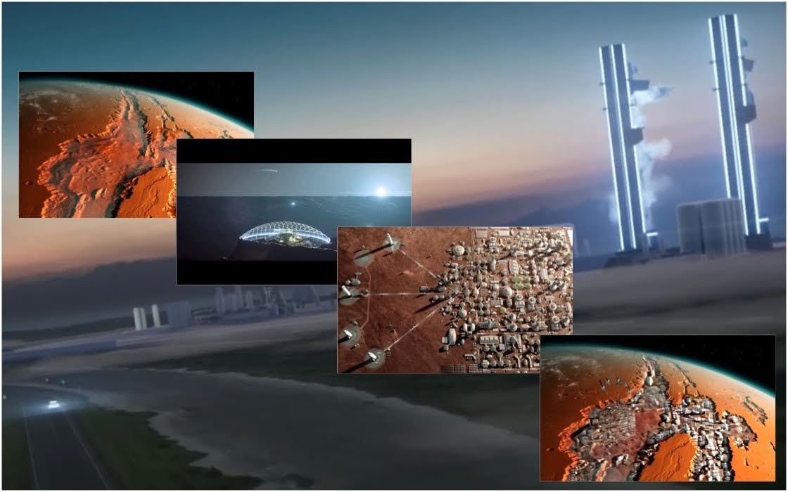
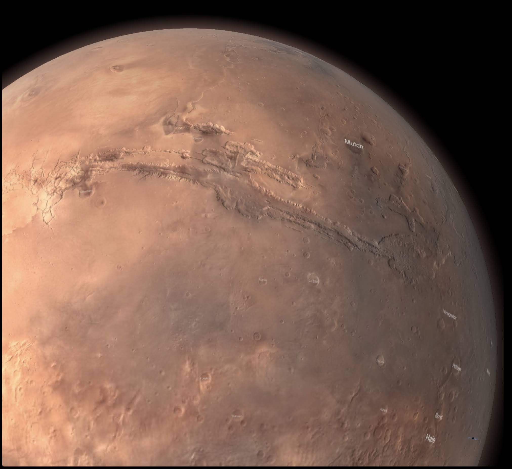
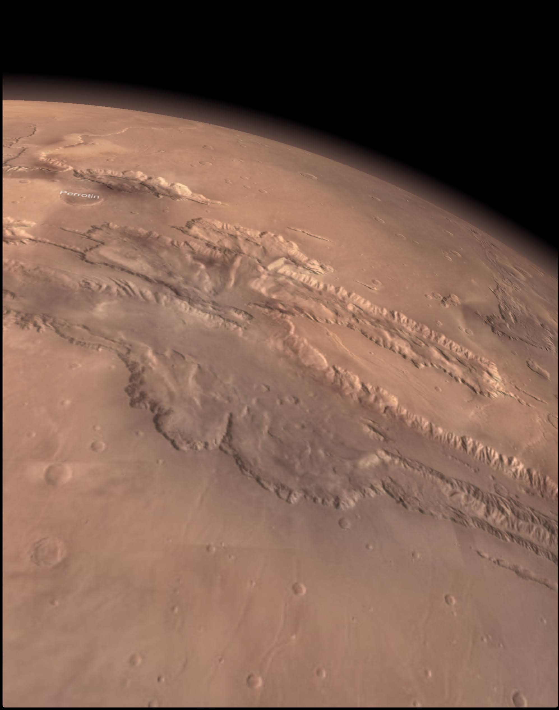
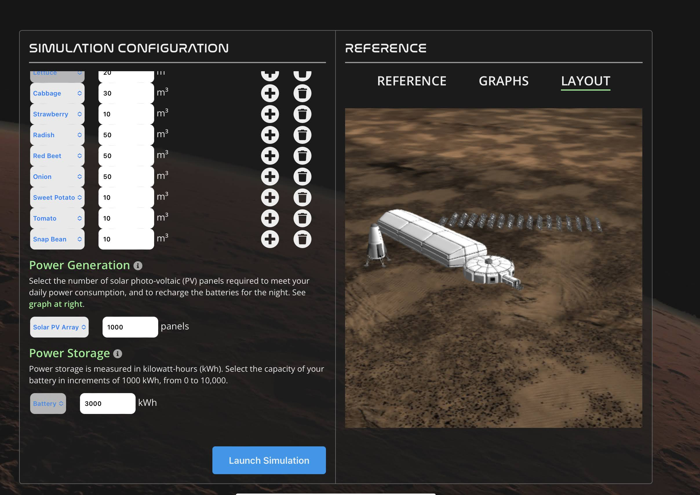

These images have been selected to inspire narratives related to lunar or martian colonisation.

Stage 1: Prepare the launch system

Stage 2: Find a good location on Mars to start making soil. 

Stage 3: Find a location in the valleys of Mars to shelter from radiation

Stage 4: Build a Martian settlement or model one in SIMOC -> https://simoc.space/simoc/

