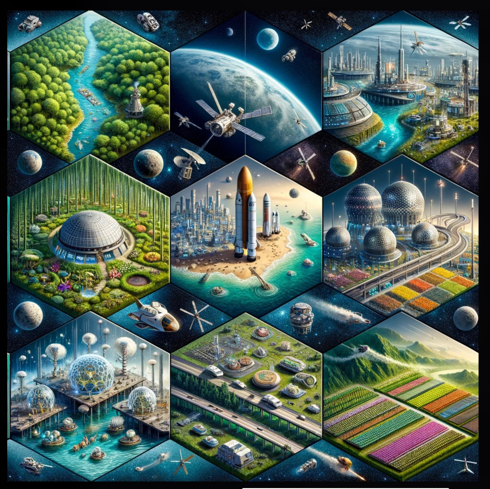

## Dalle3_promp_engineering

**Create a hyper-detailed 3D image of a game board**
Create a hyper-detailed 3D image of a game board similar to the 'Settlers of Catan' board game, with a layout that closely resembles the original photo provided, but with a futuristic space theme. The board should include seven hexagonal tiles arranged in the following manner, adding a moon piece, a space station piece, and a mars piece: 

1. A blue tile with a yellow house and a white question mark, resembling a water planet with a hidden feature. 
2. Another blue tile with wave-like patterns, indicating an oceanic planet. 
3. A reddish-brown tile with a rough, Mars-like terrain. 
4. A black tile that suggests the darkness of outer space. 
5. A green tile with a white crescent moon piece, representing a moon biome with sheep-like alien creatures. 
6. A grey tile with a space station piece, depicting a mining colony on an asteroid. 
7. A forest green tile with alien trees, symbolizing an exoplanet's forest biome.

The overall design should maintain the layout and proximity of the tiles as in the original image, with added elements to enhance the space theme.

