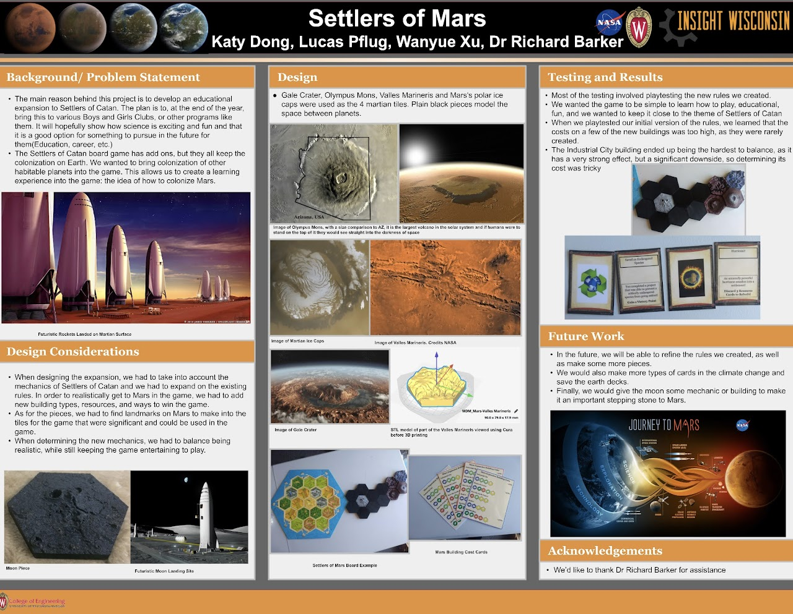

# Hello World!  

##**"Settlers of Mars and D&D Role Player Adventure: The Gateway to Space Science Mastery"**

Gone are the days when conventional games like chess or Pokémon Go were the peak of interactive learning. Now, imagine a world where the thrill of board games and role-playing adventures merge with educational prowess. Enter the realms of "Settlers of Mars" and "D&D Role Player Adventure," games that are not just pastimes but powerful tools in advancing scientific knowledge and skills, particularly in space biology, biotechnology, and aerospace engineering.

By blending the captivating elements of popular games with educational content, "Settlers of Mars" and "D&D Role Player Adventure" stand as exemplary models of how gaming can revolutionize learning in science. They are not just games; they are gateways to mastering the complexities of space science, making learning an adventure that is as thrilling as it is informative.

I hope you try to play Settlers of Mars with your friends, family, colleagues and anyone else you get to hang out with. This is a "choose your own adventure game" that can be indulged purply in the imagination using dungeons and dragon role play, or via a 2D or 3D board game based on the Settlers and Civilisation classics. Below is a poster made by the original "Insight Wisconsin" inventors club team that made the prototype game we affectionately call "Settlers of Mars". 

Picture a scenario where a player, navigating to the harsh Martian landscape in "Settlers of Mars," learns about vital space biology concepts. Each settlement they build or resource they trade mirrors real-world biotechnological advancements and ecological balancing acts necessary for surviving on another planet. This game, inspired by the mechanics of the beloved Settlers of Catan, teaches players about resource management and ecological sustainability, crucial for any aspiring space biologist or biotechnologist.

On the other hand, "D&D Role Player Adventure" takes players on a fantastical journey through the universe, where each quest and character interaction is a lesson in aerospace exploration and biotech engineering. Instead of navigating dungeons we aim to explore our solarsystem, so appreciating complexities of spacecraft design, and the dragons they defeat symbolize the overcoming of engineering challenges in space exploration. As players delve deeper into this role-playing world, they inadvertently learn about propulsion systems, space habitat dynamics, and the importance of teamwork in overcoming the astronomical odds associated with space exploration.

Both games serve as dynamic educational platforms, addressing the untaught and informal curriculum often missed in formal scientific education. They fill in the gaps left by traditional methods, offering a fun yet profound learning experience that is interactive and engaging. The collaborative nature of these games also mimics real-world scientific teamwork, teaching players the importance of collaboration, strategy, and critical thinking. So with creative adn cooperative thinking their are infintate ways to merge these dynamic gaming to an original educational experience.

## The Martian and Lunar surface designs can be found in the "STL files folder".

The making of the models is an option but does assist with creating the adventure and provides a fun project-based learning program for introductory additive manufacturing. 
### https://www.yeggi.com/q/settlers+of+catan/

Or buy the official set from the Catan Shop. 
### https://catanshop.com/catan-3d

### How to play with an AI "DnD" chatbot guide
To get started playing "Settler of Mars" players can use any of the 3 games play templates designed to tailor chatbots to facilitate an original game plan. 
These promt's can be used to train AI-GTP's to help guide you on your adventure, they can be customized to create a range of training scenarios. 

For example, feeding the chat but this report on the future of European Space Exploration can create an ESA-related spin on the game narrative. 
https://www.espi.or.at/wp-content/uploads/2023/11/Future-of-European-Space-Exploration_final-version-1.pdf

More information on how to hide scientific discoveries in the gameplay is coming soon(ish)... 

**Note:** 
It is more fun having a real character on your team, but having a well-trained AI-space wizard can help the gameplay and storyboard synthesis occur in a fun and informative fashion.  

