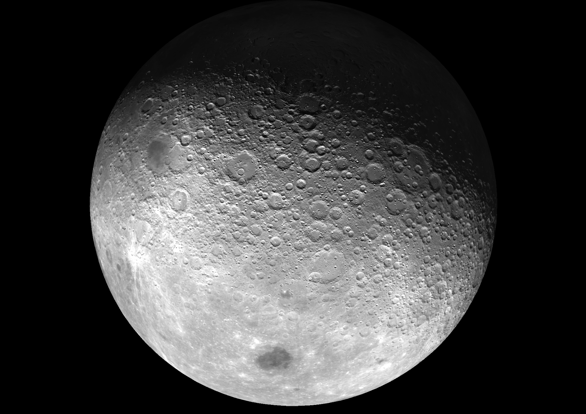

## Settlers of Mars Game plan V1

This game is the perfect blend of Dungeons & Dragons (D&D) with the turn-based mechanics of "Settlers of Catan", this can make for a fascinating and original educational game experience. Here's a basic framework you can use to get started:

## Game Setup:

**World Building**: Use the hex tiles from Settlers of Catan to create your game map. Each hex can represent a different terrain type in your D&D campaign, like forests, mountains, and fields.
**Resource Gathering**: Just like in Catan, players can gather resources like wood, brick, wheat, ore, and sheep. These resources can be used to build settlements (which could serve as bases or guilds in D&D), cities (larger fortifications or places of power), and roads (trade routes or paths of adventure).
**Character Integration**: Players would create D&D characters as normal, but their actions in the world can affect resource production. For example, protecting a forest hex from monsters might increase wood production.

## Game Play:

**Turn Structure**: Players could take turns as in Catan, using a mix of roleplaying encounters and resource management. Rolls of two six-sided dice determine which hexes produce resources each turn, integrating the chance aspect of D&D encounters.
**Development Cards**: These could be re-flavored as magic items, blessings, or character-specific skills and quests.
**Victory Points**: Achieving certain feats or milestones in the D&D campaign could earn players victory points. This could be things like slaying a dragon, completing a major quest, or building a capital city.

## Strategic Tips:

**Resource Management**: Balance the collection of resources with your D&D objectives. Sometimes it may be better to go on a quest than to build a new road.
**Trading**: Leverage D&D's social and bartering aspects to make advantageous trades with both NPCs and other players.
Adaptability: Be ready to adjust your strategy based on the evolving D&D storyline and the resources available to you.

Remember, this is just a starting point, the sky is not the limit. 

