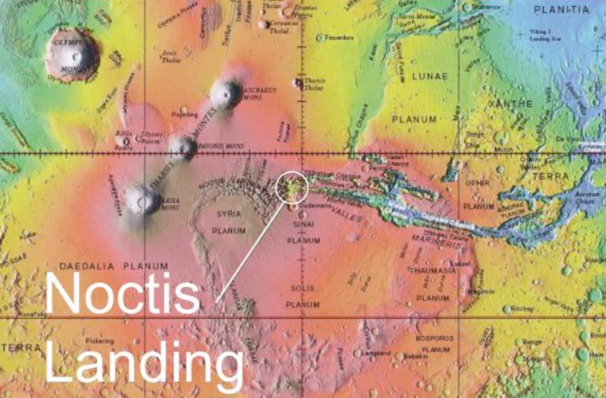

# AstroBotany board game

### Stage1 : Earth Forest City Government

Nestled within a protective dome, Government City emerges as a unique blend of urban development and natural wonder. This remarkable city, harmonized with a lush forest environment, stands as a testament to innovative ecological preservation and urban planning on Earth.\

<figure><figcaption></figcaption></figure>

| Concept        | Factor                                |   |
| -------------- | ------------------------------------- | - |
| Location       | Earth                                 |   |
| Biome          | Forest                                |   |
| Human function | 
City (domed)

Government 
 |   |

\

### **Stage 2: Earth Field** Aerospace Industry

<figure><figcaption></figcaption></figure>

* **Terrestrial Domed Research Base:** A cutting-edge facility designed for safety and sustainability, providing a controlled environment for scientific advancements.
* **Terrestrial Launch Pad:** State-of-the-art infrastructure to support spacecraft takeoffs and landings, facilitating exploration and resource transportation.
* **Terrestrial Fields and coast:** Expansive agricultural areas utilizing advanced hydroponics and aeroponics, ensuring food security and research opportunities on crop growth in unique environments.
* **Orbital Earth Observation System:** A sophisticated monitoring system for global weather patterns, environmental changes, and potential hazards, ensuring a continuous connection with Earth's ecosystem.

\

### **Stage 3: Space Stations in Leo Earth Orbit**

<figure><figcaption></figcaption></figure>

The concept of "Space Ocean Trading" encompasses the cutting-edge developments in satellite technology, telescopes for deep space observation, and the establishment of refueling stations in Low Earth Orbit (LEO). This idea represents a monumental leap towards creating a sustainable infrastructure for space exploration and commerce.

**Satellites:** Advanced satellites play a crucial role in communications, Earth observation, and scientific research, facilitating a global data exchange network essential for the burgeoning space economy.

**Telescopes:** State-of-the-art telescopes stationed in space have the unparalleled advantage of observing cosmic phenomena without atmospheric distortion, opening new frontiers in astronomy and astrophysics.

**Refueling Stations:** The development of refueling stations in LEO is a game-changer, enabling longer missions, reusability of spacecraft, and a significant reduction in operational costs, thereby accelerating the pace of space exploration and commercialization.

**Biomedical research factories:** The development of organ on a chip and the use of spaceflight-induced accelerated aging leads to a revolution in personalized genomics analysis and the development of a new system of personsalized anti-cancer medicinal treatments that prevent and essentially cure cancer on earth.&#x20;

\

##

### **Stage 4: "**Lunar gateway" orbital space station in cis-lunear space&#x20;

**Satellite and Telescope Deployment:** The lunar government has embarked on an ambitious project to enhance its capabilities in outer space observation and communication. This includes the deployment of advanced satellites and telescopes aimed at improving scientific research and maintaining global communications. These tools will provide invaluable data on cosmic phenomena and aid in deep space exploration.

**Refueling Operations:** To support continuous and extended space missions, the lunar government is establishing refueling stations on the moon. These facilities will offer vital services such as fuel replenishment, maintenance, and repair for spacecraft. This initiative is a step towards sustainable space exploration, ensuring that missions have the necessary resources for their journeys beyond the moon.

**Lunar Space Station:** A cornerstone of the lunar government's space strategy is the development of a Lunar Space Station. This facility will serve as a hub for scientific research, a docking station for spacecraft, and a launchpad for missions to further reaches of our solar system. The space station will also facilitate international cooperation in space exploration, inviting collaboration from countries worldwide.

\

## **Stage 5: Lunar** Domes Crater Town for Mining and Military

<figure><figcaption></figcaption></figure>

**The lunar operations at Domes Town focus on two main areas:** the crater mining industry and the infrastructure for spacecraft landing and launch pads. Domes Town is at the forefront of expanding humanity's presence on the Moon, through its critical mining operations and state-of-the-art space travel infrastructure.

**Crater Mining Industry:** The crater mining industry is a cornerstone of lunar resource extraction, providing valuable materials necessary for both lunar construction and supply back to Earth.

**Landing and Launch Pad:** The landing and launch pads serve as the gateway for all spacecraft. These facilities ensure smooth operations for cargo and crew arrivals and departures, playing a crucial role in the sustainability of lunar habitation and exploration.

**Space Force command-center:** The United Nations and space force lunar operations center was established to ensure a safe working environment for international mining corporations. They provide cis-admin services to the settlement including police, medical, fire fighting, sanitation and garage recycling.  \

## **Stage 6: The Lunar** Artemis City: A Glimpse into the Future

<figure><figcaption></figcaption></figure>

**Lunar Artemis City:** At the heart of these developments lies Artemis City, a beacon of human ingenuity and resilience. This settlement showcases the possibilities of lunar living, from residential areas and research facilities to recreational spaces. Artemis City stands as a testament to what humanity can achieve when we reach for the stars.

**Underground Farms:** To support the residents and visitors, lunar agriculture takes an innovative turn with underground farms. Utilizing hydroponics and artificial lighting, these farms would yield a variety of fresh produce, essential for long-term lunar habitation and enhancing the self-sufficiency of Artemis City.

**Lunar Olympics:** Envision a future where athletes from around the world gather not on Earth, but on the Moon, to compete in a unique, low-gravity environment. The Lunar Olympics would not only push the boundaries of human physical prowess but also highlight advancements in space travel and habitation.

**Tourism:** The allure of the Lunar Olympics opens up unprecedented tourism opportunities. Visitors would experience the thrill of lunar landscapes, low gravity adventures, and the historic sites of humanity's first steps on another celestial body. This novel destination offers a once-in-a-lifetime journey beyond Earth’s atmosphere.

**Fusion Power Generators:** Powering this lunar dream requires cutting-edge technology. Fusion power generators, capable of producing vast amounts of clean energy, would be the backbone of the lunar infrastructure. These generators ensure a sustainable and reliable energy source for both the Olympic facilities and Artemis City.

### **Stage 7:** Martian lunar Space Stations on both _Phobos and Deimos_

<figure><figcaption>
Credits: National Space Society
</figcaption></figure>

The mars moon space stations serves as a pivotal hubs in the trading system. Located on Phobos or Deimos, Mars' moons, it offers a unique vantage point for overseeing trade operations, conducting research, and providing maintenance and support services to passing trading fleets. This advanced infrastructure marks a new era in the expansion of human presence in space, promising a future where interplanetary trade is as commonplace as its terrestrial counterpart.

**Space-Ocean Trading System:** As humanity expands its reach into the cosmos, the establishment of a robust trading system is crucial for sustaining life and economic growth on new planetary outposts. The Martian government has spearheaded this initiative by proposing an innovative space-ocean trading system.

**Martian Government:** Under the leadership of the Martian administration, regulations have been established to oversee the trading between Earth, Mars, and other celestial bodies. This initiative aims to bolster interplanetary commerce, fostering a diverse economic ecosystem that benefits all stakeholders in space.

**Communications Satellites and Telescopes:** An intricate network of communications satellites and telescopes forms the backbone of the space-ocean trading system. These technologies enable real-time data exchange and navigation across vast distances, ensuring traders can operate efficiently and safely within the solar system.

**Refueling Stations:** To facilitate continuous trade routes, refueling stations have been strategically placed throughout key locations in space. These outposts ensure that trading vessels can replenish their resources, significantly extending their operational reach and endurance during long-haul voyages.

### &#x20;

## **Stage 8: Martian** Domed Industry Town&#x20;

**The Dome Industry Town:** This pioneering settlement designed for Mars, featuring advanced infrastructure to support automated mining operations. Key to its functionality are the dedicated landing and launch pads, which facilitate efficient transport of personnel and resources to and from the planet.

**Semi-automated Mining:** Robotic assisted mining is the backbone of the Dome Industry Town, utilizing cutting-edge robotics and AI to efficiently extract valuable minerals and resources. This automation ensures operational efficiency and safety, minimizing human exposure to Mars' harsh environment.

**Landing and Launch Pad:** The town is equipped with state-of-the-art landing and launch pads, crucial for the seamless exchange of goods and the travel of astronauts. These platforms support a variety of spacecraft, enabling the town to serve as a central hub for Martian exploration and trade.

\

### **Stage 9:** Martian city tunnel city links Valles Marineris to Noctis Landing "Labyrinth".&#x20;

\

<figure><figcaption></figcaption></figure>

**The underground Martian Mega City:** The pinnacle of human ingenuity and ambition in space exploration. Embarking on this journey entails developing sustainable habitats, life support systems, and technologies to utilize local resources, laying the groundwork for human presence on the Red Planet and beyond.

**Hyperloop Expansion: Beyond Conventional Transit:** The concept of expanding hyperloop technology presents a transformative leap in transportation infrastructure. This initiative envisions a network of low-pressure tubes enabling high-speed travel between distant locations, significantly reducing commute times and reshaping urban mobility.

**Underground City Agriculturial revolution:** Underground city farming emerges as a groundbreaking solution to the challenges of urban space constraints and sustainability. By utilizing subterranean spaces, this innovative approach to agriculture harnesses controlled environment farming techniques, promising to enhance food security and reduce environmental impacts.

### **Stage 10:** Mining Settlement in the Asteroid Belt

<figure><figcaption>
Image from national geographic.
</figcaption></figure>

The Semi-automated Mining Settlement is a pioneering initiative located within the asteroid belt. This complex serves as a hub for a multitude of space-faring activities including asteroid mining, interstellar trade, scientific research, and even refueling operations for spacecraft journeying through the solar system. The Space Ocean Trading and Mining Settlement is at the forefront of space colonization and resource extraction. With its multifaceted facilities, it not only serves the immediate needs of its inhabitants and workers but also plays a crucial role in the broader context of interstellar development and exploration.

**Semi-automated Asteroid Mining System:** The cornerstone of the settlement, our asteroid mining system, utilizes advanced technology to extract valuable minerals and resources from the asteroids within the belt. This not only supplies essential materials for space construction but also for export back to Earth and other colonies.

**Dome Mining Settlement:** Our Dome Mining Settlement offers a secure and habitable environment for workers and their families. It’s designed to support a sustainable community, complete with living quarters, recreational facilities, and hydroponic gardens to provide food and oxygen.

**Communication Satellites and Telescopes:** Strategically positioned satellites enhance our ability to communicate across vast distances, not only within the asteroid belt but with Earth and other colonies. The telescopes installed here are vital for deep space observation, allowing us to study cosmic phenomena and navigate safely through the cosmos.

**Refueling Station:** A critical component of the infrastructure, the refueling station supports passing spacecraft with necessary fuel and maintenance services. This ensures continuous operation of all space voyages, whether for exploration, trade, or emergency missions.

\

\

